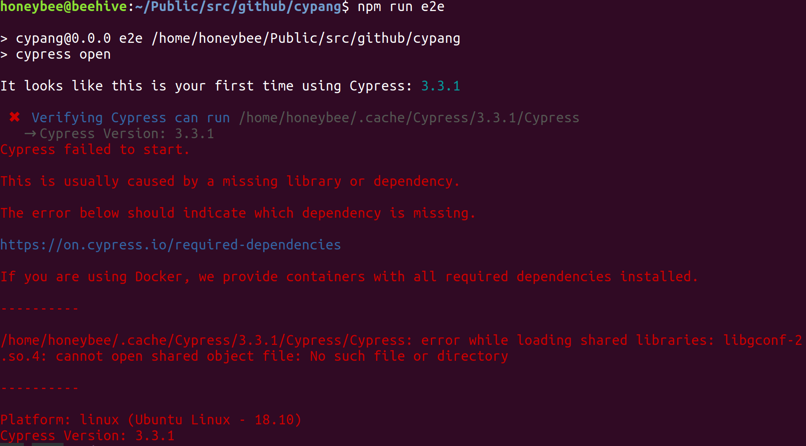
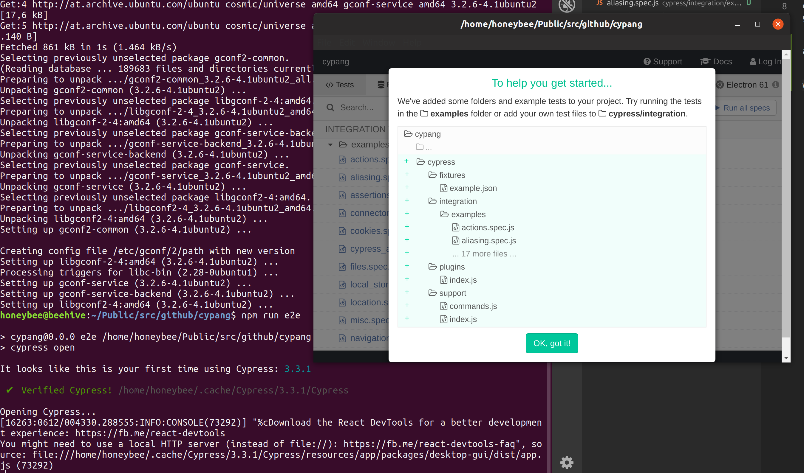

first steps
===========

to install a cypress all you have to do is
npm i cypress --save-dev

How do I run my first test and see what it can do?
oh yes, one more step to do,
go to package.json and add this as a command:
"e2e": "cypress open"

and we get 

works as expected on windows, though :-)
